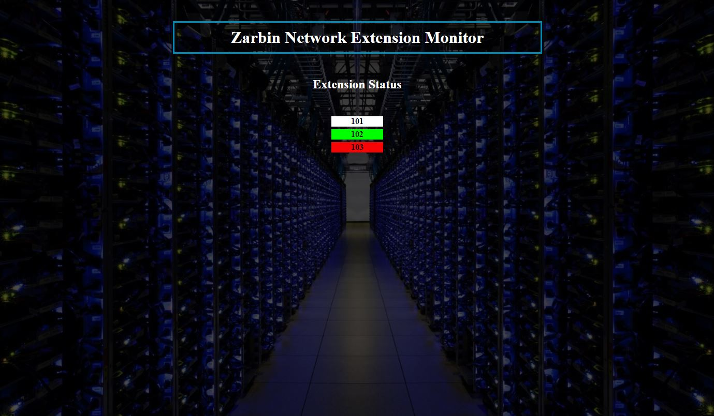

# issabel Extension Status Monitoring
Simple Monitoring issabel Extensions Status



1. Copy all downloaded file in `/var/www/html` directory on issabel
2. Set `775` or `777` permission to `zarbinMonitor.php` and `zarbinMonitor_Main.php`
3. Create AMI User on `/etc/asterisk/manager_custom.conf` 
> UserName is : test

> Secret is : 123456
```
[test]
secret = 123456
deny=0.0.0.0/0.0.0.0
permit=0.0.0.0/0.0.0.0
read = system,call,log,verbose,command,agent,user,config,dtmf,reporting,cdr,dialplan
write = system,call,log,verbose,command,agent,user,config,command,reporting,originate
```
4. Reload Asterisk AMI
```bash script
asterisk -r
manager reload
exit
```
5. Open `zarbinMonitor_Main.php` and edit tags `//DB Settings` and `//AMI Settings` user and pass field 
```php
//DB Settings
$user="root";
$pass="123456";

//AMI Settings
$remote_name = "test";
$remote_secret = "123456";
```
5. Open `https://issabel_IP_Address/zarbinMonitor.php` and Enjoy it!
